# Functional build brief: adaptive flashcard learning mode

## Purpose and replication boundary

Build an adaptive study mode that turns a two-sided flashcard set into a continuously personalized practice session. It must behave like Quizlet Learn **functionally**, not visually: it selects the next fact needing the most work, starts with supported recognition and progresses to harder recall, immediately grades and explains every attempt, makes missed facts reappear, and persists per-user progress.

Do not copy Quizlet branding, UI copy, logos, content, or design. Do not claim the scheduling model is Quizlet's exact proprietary model. Quizlet publicly confirms the inputs to its historical model and the high-level behavior, but not the live model weights, mastery thresholds, or exact onboarding labels. The implementation below is deliberately explicit so a coding agent can build a behaviorally equivalent product rather than inventing vague "AI learning" behavior.

## Definition of done

A user can create or open a flashcard set, choose Learn, configure a session, answer questions in either direction, get immediate feedback, see difficult material reappear more often, progress from recognition to recall, and return later with their learning state intact. The app must maintain these three per-set groups:

- `not_studied`: no graded attempt on either enabled direction.
- `still_learning`: attempted, but does not meet mastery requirements.
- `mastered`: sufficiently reliable recall in every enabled direction.

The product must work without an AI API. AI/semantic grading is an optional, server-side enhancement, never the only way to grade.

## Scope

### Required objects

1. **User**: authenticated user ID. For a prototype, use a stable anonymous ID in local storage, but all progress records must be keyed to a user ID.
2. **Study set**: `id`, `owner_id`, `title`, `description`, source languages, timestamps.
3. **Card**: `id`, `set_id`, `position`, `term`, `definition`, optional image/audio on either side, optional accepted aliases, optional language metadata, optional rich-text/list structure, `starred` is user-specific.
4. **Card direction**: treat `term -> definition` and `definition -> term` as separate but related facts. Do not mark both mastered merely because one direction was correct.
5. **Optional authored MCQ choices**: for a card, an array of answer choices and the correct choice IDs. If none exist, generate distractors from other eligible cards in the set.
6. **Learn configuration**: question types, directions, starred-only scope, shuffle, audio, answer grading rules, retype-missed rule, and target/mastery goal.
7. **Learn path**: durable progress for one user + one set + configuration fingerprint. It can be resumed across devices. A configuration change should not erase all history; it only changes the active candidate pool and may reset the visible answer streak.
8. **Attempt event**: immutable log of each displayed question and outcome. Store question type, card, direction, submitted answer or selected option, first-attempt flag, automatic grade, override status, elapsed time, and timestamp.

## Functional user flow

### 1. Open Learn

From a study-set page, expose a Learn action. On entry:

- Load the user's durable progress for this set.
- If there is no existing path, show a lightweight setup flow. Its job is functional personalization only; exact wording and visual design do not matter.
- If a resumable path exists, offer `Continue` and `Start over`. Continuing retains progress and settings. Starting over deletes the Learn-path progress for this set after an explicit confirmation; it must not delete the card set itself.

### 2. Initial setup / session configuration

Use this sequence:

1. Choose scope: all cards or only the user's starred cards. Disable starting if the chosen scope contains no cards.
2. Choose direction: `term -> definition`, `definition -> term`, or both. If the set has language fields, allow choosing an answer language/direction, but persist this as direction settings rather than a special mode.
3. Choose which question types are enabled: multiple choice, self-assessed flashcard, written response, and—when appropriate—select-all-that-apply. Offer dedicated Write and Spell modes as optional variants described below.
4. Ask a non-binding familiarity question for a first-time path: `new to this`, `know some`, or `know most`. Do not mark anything mastered from this self-report. Use it only to set an initial recall prior and the initial question-type mix.
5. Ask for the goal: default to `master all selected cards in this session`. An implementation may offer a time/card-count goal, but mastery must remain the primary completion criterion.
6. Persist the path only when the user actually starts answering, not merely when setup is opened.

### 3. Study loop

For every turn:

1. Build the eligible card-direction candidates using current configuration and learned state.
2. Estimate recall probability for each candidate.
3. Select a candidate with the lowest estimated recall probability, subject to anti-repetition rules and a controlled new-card introduction rate.
4. Select the question type based on the candidate's predicted mastery and content constraints.
5. Render one question and wait for an answer. Never silently advance.
6. Grade immediately, record an attempt, update the card-direction state, update the answer streak, and update the session progress.
7. Display explicit feedback before allowing the next question. On an incorrect answer, show the correct response and how to continue.
8. If the user finishes the goal, show a results state with the three groups and actions to review `still_learning`, restart, or leave.

The progress indicator should show progress toward the active study goal, not merely `number of cards viewed / number of cards`. A card can be seen several times before it is mastered.

## Question types and exact behavior

### A. Multiple choice

- Display a prompt from the selected direction and exactly four answer choices whenever four unique eligible choices exist.
- Use authored choices when present; otherwise use the correct opposite side plus three unique values from other cards in the current set. Never create duplicate normalized answers. If fewer than four answers exist, use as many as are available; do not fabricate nonsense distractors.
- Randomize option order on every presentation. Store the option order in the attempt event for reproducibility.
- One click selects and submits the answer. Lock all choices after submission.
- Feedback must identify the selected answer and correct answer. Incorrect answers require an explicit `Continue`; correct answers may auto-advance only if the user enabled auto-advance.
- Multiple choice is the easier recognition format. It is most common for newly introduced or low-confidence facts.

### B. Self-assessed flashcard

- Show only the prompt side initially. The learner must reveal the answer.
- After reveal, present `I knew it` and `I did not know it` (or equivalent) controls. A reveal alone is not a correct response.
- `I knew it` records correct; `I did not know it` records incorrect and schedules an earlier review.
- Use this type when text is too long to reasonably type, when the answer is non-textual (for example, an image/diagram label), or between multiple choice and written recall. It is a harder step than recognition but easier than typed recall.

### C. Written response

- Display the prompt and a single focused input. Submit with Enter or an Answer button.
- Do not reveal the answer before grading.
- Grade with the strictness rules below.
- On incorrect: show the canonical answer, identify it as incorrect, provide `I was correct` (manual override), `Don't know`, and `Continue` controls. `Don't know` counts as an incorrect first attempt.
- If `retype correct answer after a miss` is enabled, require the learner to enter the canonical answer correctly before they can continue. The initial incorrect attempt still counts as incorrect; the retype event is a corrective exposure, not an independent mastery success.
- Written questions are the most difficult normal format and should appear increasingly often as recall probability improves.

### D. Select all that apply

Enable only if a term or definition has a structured list (bullets, numbered items, or explicitly stored answer parts) **and** multiple choice is enabled.

- Build a multi-select question with all correct list parts and plausible distractor parts from comparable list cards.
- A response is correct only if the selected set exactly equals the correct set, unless the item explicitly permits partial-credit scoring.
- Default Learn behavior should not grant mastery from partial credit; record partial-credit metadata for analytics and give targeted feedback on missed/extra selections.

### E. Dedicated Write mode

This is a typed-only round available from Learn options.

- Present every active card once in the chosen direction.
- Track misses and bring them back in a follow-up review round.
- A card is complete only after two correct typed answers across the mode; a wrong answer requires it to be typed correctly again before mode completion.
- Include `Don't know` and `I was correct` override behavior.

### F. Dedicated Spell mode

Use for text-only, spelling-sensitive material.

- Play text-to-speech for the prompt, including a replay button. Support normal and slow playback.
- The learner types the spoken term/definition.
- Disable typo tolerance and semantic grading in this mode.
- On a misspelling, highlight wrong/missing letters, show/spell the canonical text, and requeue the fact. Require two correct spellings to complete the item.

## Adaptive scheduling engine

### Model principles to preserve

The engine chooses the fact most likely to be forgotten or least likely to be recalled correctly. It must account for:

- correctness of recent and older answers, with recent answers weighted more heavily;
- elapsed time since the latest attempt (recall confidence decays with time);
- spacing between recent attempts (greater prior spacing improves retention);
- study direction; and
- question-type difficulty (recognition is easier than typed recall).

This is a session-aware adaptive queue, not a simple random deck and not a pure Anki/SM-2 scheduler.

### Required state per user + card + direction

```ts
type DirectionState = {
  userId: string;
  cardId: string;
  direction: "term_to_definition" | "definition_to_term";
  status: "not_studied" | "still_learning" | "mastered";
  initialPrior: "new" | "some" | "most";
  attempts: number;
  correctAttempts: number;
  incorrectAttempts: number;
  consecutiveCorrect: number;
  firstTryCorrectCount: number;
  lastOutcome: "correct" | "incorrect" | null;
  lastAttemptAt: string | null;
  previousAttemptAt: string | null;
  lastQuestionType: QuestionType | null;
  recallProbability: number; // recalculated, never hand-edited
  dueAt: string | null;
  updatedAt: string;
};
```

### Deterministic recall estimator

Start with this transparent approximation. Keep its coefficients server-configurable so later real user data can tune them.

```ts
function estimateRecall(s: DirectionState, now: Date, q: QuestionType): number {
  const base = s.initialPrior === "most" ? 0.62 : s.initialPrior === "some" ? 0.42 : 0.24;
  const hoursSince = s.lastAttemptAt ? Math.max(0, hours(now, s.lastAttemptAt)) : 0;
  const previousGapHours = s.lastAttemptAt && s.previousAttemptAt
    ? hours(s.lastAttemptAt, s.previousAttemptAt)
    : 0;

  // Recent correct answers help; wrong answers hurt more; their influence fades.
  const outcomeSignal =
    0.22 * s.consecutiveCorrect +
    0.04 * Math.min(6, s.correctAttempts) -
    0.30 * Math.min(4, s.incorrectAttempts) +
    (s.lastOutcome === "correct" ? 0.18 : s.lastOutcome === "incorrect" ? -0.25 : 0);

  // Forgetting over time and benefit from previous spacing.
  const timeDecay = -0.11 * Math.log1p(hoursSince);
  const spacingBenefit = 0.055 * Math.log1p(previousGapHours);
  const difficulty = {
    multiple_choice: 0.24,
    flashcard_self_assessed: 0.08,
    written: -0.16,
    select_all: -0.10,
    spell: -0.20,
  }[q];

  return sigmoid(logit(base) + outcomeSignal + timeDecay + spacingBenefit + difficulty);
}
```

The numbers are implementation defaults, not claims about Quizlet's hidden weights. Preserve the essential behavior: a miss immediately pushes an item near the top; an item left untouched becomes more urgent; a fact known only in one direction remains a candidate in the reverse direction.

### Candidate selection algorithm

Run this on the server before each question:

```ts
function chooseNextQuestion(path: LearnPath, now: Date): QuestionPlan {
  const candidates = eligibleCardDirections(path)
    .filter(c => !shownTooRecently(c, path, 2)); // normally require 2 other questions

  const fallback = candidates.length ? candidates : eligibleCardDirections(path);
  const needsIntroduction = fractionNewCardsShown(path) < 0.30 && hasUnseen(fallback);
  const pool = needsIntroduction ? unseenOnly(fallback) : fallback;

  for (const candidate of pool) {
    candidate.questionType = chooseQuestionType(candidate, path.settings, now);
    candidate.recallP = estimateRecall(candidate.state, now, candidate.questionType);
    candidate.urgency = 1 - candidate.recallP;
    if (candidate.state.lastOutcome === "incorrect") candidate.urgency += 0.18;
    if (candidate.state.status === "mastered") candidate.urgency -= 0.35;
  }

  // Give the top few candidates a weighted random pick to avoid mechanical repetition.
  const top = pool.sort(byUrgencyDesc).slice(0, Math.min(5, pool.length));
  return weightedRandom(top, c => Math.exp(4 * c.urgency));
}
```

Rules:

- Before mastery, requeue an incorrect fact after roughly 2–4 intervening questions; use a shorter delay for a `Don't know` response and a longer delay for an almost-correct typed response.
- Do not show the exact same card-direction twice in a row unless it is the only eligible candidate or the learner is completing a forced retype correction.
- Keep a small stream of unseen cards. A default of at least 30% newly introduced cards while unseen cards remain prevents the session from becoming an endless loop on one miss.
- When both directions are enabled, schedule the weaker direction preferentially. Give a small positive transfer from the stronger direction, but never enough to suppress reverse-direction practice entirely.
- For `shuffle` mode, randomly select among candidates in the same urgency band; do **not** abandon adaptive prioritization.

### Question-type selection

```ts
function chooseQuestionType(candidate, settings, now): QuestionType {
  const allowed = allowedTypesForContent(candidate, settings);
  const pWritten = estimateRecall(candidate.state, now, "written");

  if (allowed.includes("written") && pWritten >= 0.78) return "written";
  if (allowed.includes("flashcard_self_assessed") && pWritten >= 0.56) {
    return "flashcard_self_assessed";
  }
  if (allowed.includes("multiple_choice")) return "multiple_choice";
  if (allowed.includes("flashcard_self_assessed")) return "flashcard_self_assessed";
  return allowed[0];
}
```

Content constraints override the ladder:

- Never use written response for diagram locations, media-only cards, or answers above a practical character threshold (default 160 characters). Use self-assessed flashcards.
- Prefer Spell where spelling-sensitive mode is selected.
- Use select-all only for structured multi-part content.
- If the user manually enables a single question type, honor it; adapt the order of facts but not the format.

### Mastery rule

For the functional replica, declare a card-direction mastered only when all are true:

1. at least two correct graded attempts exist;
2. the most recent attempt is correct;
3. the estimated recall probability in the hardest enabled valid question type is at least `0.85`; and
4. no incorrect attempt has occurred in the last two attempts.

A card is `mastered` only when every active direction is mastered. If an old mastered card is later missed, immediately demote that direction and the parent card to `still_learning`.

## Grading

### Normalization and accepted answers

Store canonical answers and aliases as structured answer variants. Before comparing typed answers:

1. normalize Unicode (`NFKC`), trim, lowercase, collapse repeated whitespace;
2. remove punctuation only for non-language, non-formula content;
3. accept explicitly authored aliases;
4. when `require one answer only` is enabled, split the canonical definition on comma, slash, and semicolon; grade correct if the submission contains one complete accepted answer variant;
5. otherwise require all required answer parts according to the card's structured answer definition.

### Typo Help

Implement typo tolerance after exact/alias matching:

- accept if Levenshtein edit distance is 1 or less, **or** is at most 15% of the canonical answer length;
- accept answers differing only by English articles (`a`, `an`, `the`);
- disable this tolerance for Spell mode, language-learning cards, formulas, numbers, dates, code, and explicitly exact answers.

### Semantic (smart) grading

Make this an opt-in setting. After deterministic grading fails:

1. reject semantic grading for formulas, numeric values, dates, chemical notation, code, and answers shorter than three meaningful tokens;
2. pass the prompt, canonical answer, aliases, and learner response to a server-side semantic-similarity grader;
3. accept only if confidence is high (default similarity threshold `>= 0.88`) and a contradiction/numeric mismatch check passes;
4. store the model score and reason; keep manual override available.

Do not send learner answers directly to a model provider from the browser. The server must redact/minimize data and rate-limit requests. Semantic grading should err toward `incorrect` when uncertain; the learner can override.

### Overrides and feedback

- `I was correct` changes the event to correct, increments mastery/streak exactly as a first-try correct answer, and records `was_overridden=true` for later tuning.
- `Don't know` is an explicit incorrect attempt, ends the answer streak, and puts the item into the near-term review queue.
- On every incorrect answer, show the full correct answer, not only a generic wrong signal.

## Streaks and session progress

Add an answer streak to Learn:

- Increase it only on a correct **first attempt**. Repeated corrections after a miss do not restore it.
- The visible streak starts after five consecutive first-try correct answers; retain the count even before it becomes visible.
- Any incorrect answer or `Don't know` resets it to zero.
- A manual `I was correct` override keeps the streak alive.
- Changing enabled question types resets the visible streak to zero, but not the learned card state.

Persist session metrics: questions shown, first-try correct, total correct, incorrect, overrides, elapsed time, current streak, longest streak, and the start/end states of every card.

## Options menu

The Learn settings must be available before and during a session. Changes apply to the next question and persist to the path unless the user chooses one-session-only behavior.

- active directions / answer with term, definition, or selected language;
- study all cards or starred cards only;
- shuffle within priority bands;
- enable/disable audio and choose normal or slow text-to-speech;
- enable/disable each question type;
- enable select-all when eligible;
- written-answer grading: require one answer only versus all required answers;
- enable/disable semantic grading;
- retype correct answer after missed written question;
- Start over / reset Learn progress, with a confirmation.

Changing scope or directions must recompute completion for the active view; it must never delete hidden-direction history. If a user turns written off, mastery can only be proven with the hardest remaining enabled format. Make this transparent in the results state.

## Persistence and data model

Use Postgres/Supabase, Firebase, or equivalent. Recommended tables:

```sql
users(id, ...)
study_sets(id, owner_id, title, description, created_at, updated_at)
cards(id, set_id, position, term, definition, term_lang, definition_lang,
      term_media_json, definition_media_json, answer_parts_json, aliases_json)
card_mc_choices(id, card_id, side, value, is_correct, position)
user_card_flags(user_id, card_id, starred, updated_at)
learn_paths(id, user_id, set_id, configuration_json, goal_json,
            status, started_at, completed_at, updated_at)
learn_direction_states(id, path_id, card_id, direction, status,
                       attempts, correct_attempts, incorrect_attempts,
                       consecutive_correct, first_try_correct_count,
                       last_outcome, last_attempt_at, previous_attempt_at,
                       last_question_type, recall_probability, due_at, updated_at)
learn_attempts(id, path_id, card_id, direction, question_type,
               prompt_snapshot, choices_snapshot_json, submitted_response_json,
               automatic_grade, final_grade, was_overridden, first_attempt,
               elapsed_ms, created_at)
learn_sessions(id, path_id, settings_snapshot_json, started_at, ended_at,
               status, questions_shown, correct_count, incorrect_count,
               current_streak, longest_streak)
```

Use a transaction for grading: insert attempt -> update direction state -> update card/set group -> update session counters -> calculate the next candidate. Never trust a client-supplied `correct=true` flag.

## API contract

Use a server API (or server actions) with these behaviors:

| Endpoint | Behavior |
| --- | --- |
| `POST /learn/paths` | Validate configuration; create or resume a path and session. Do not write mastery before the first attempt. |
| `GET /learn/sessions/:id/next` | Run the scheduler and return a signed question plan: prompt, media, choices, question type, attempt token, and progress summary. Do not return correct-answer fields for written questions. |
| `POST /learn/attempts` | Accept `attemptToken`, submitted answer/choice/self-rating, and elapsed time. Grade server-side; atomically update durable state; return feedback plus next-action requirements. |
| `POST /learn/attempts/:id/override` | Mark the previous graded answer correct, recalculate state/streak, log the override, and return corrected feedback. |
| `PATCH /learn/paths/:id/settings` | Validate setting changes; persist; return recalculated groups and session status. |
| `POST /learn/paths/:id/reset` | Require explicit confirmation flag; delete only path/session/state/attempt progress for this user-set path. |
| `GET /sets/:id/progress` | Return the three groups, per-direction detail, and starred status for the set overview. |

Make attempt tokens short-lived and single-use. This prevents the client from replaying a correct option after seeing feedback.

## Client state machine

```mermaid
stateDiagram-v2
  [*] --> Setup
  Setup --> Studying: start session
  Studying --> Answering: question plan loaded
  Answering --> Feedback: submit, reveal + self-rate, or don't know
  Feedback --> Answering: continue; goal incomplete
  Feedback --> Retype: missed written answer + retype enabled
  Retype --> Answering: corrective retype accepted
  Feedback --> Complete: goal met
  Studying --> Paused: exit
  Paused --> Answering: resume
  Complete --> Setup: restart or change scope
```



All important state comes from the server response. The browser may optimistically show a selected option but must reconcile to the returned grade.

## Accessibility, keyboard, and media behavior

- Give every answer control a real button/checkbox/radio semantic and clear focus order.
- Support keyboard: `1`–`4` select multiple-choice options, Enter submits a written answer, Space reveals a flashcard, and arrow keys must never accidentally submit an answer.
- Announce feedback through an ARIA live region.
- Text-to-speech must be replayable; do not autoplay on every navigation if the user disabled audio.
- Never make color the only correctness signal. Include text/icon labels and expose correct/incorrect state to assistive technology.
- Pause timers and audio when the tab becomes hidden; elapsed-time analytics should exclude long background pauses.

## Acceptance tests

Build these before considering the feature complete:

1. A new user with a 20-card set starts in multiple choice; after repeated correct answers, written/flashcard questions appear more frequently.
2. A missed card reappears before an already-mastered card, with at least two other questions in between when possible.
3. A card correct `term -> definition` but untested `definition -> term` remains `still_learning` when both directions are active.
4. A correct multiple-choice answer stores the randomized options and changes state once; double-clicking cannot create two attempts.
5. A wrong written answer displays the canonical answer, ends the streak, and—when retype is on—requires a correct retype before continuing.
6. `I was correct` changes a false negative to correct and continues the first-try streak; its audit flag remains visible in data.
7. Typo Help accepts a one-character/15%-or-less typo and article-only differences but rejects the same typo in Spell mode.
8. `require one answer only` accepts one valid comma/slash/semicolon-separated response; strict all-answers mode does not.
9. A mastery-state card later answered incorrectly immediately returns to `still_learning`.
10. Toggling question types resets the answer streak but preserves direction-state history.
11. Restarting Learn deletes only the current user's study progress for that set; it leaves their cards, stars, and other users' progress untouched.
12. After closing and reopening on another browser/device, the user resumes the same path, groups, and scheduler state.

## Suggested build order

1. Implement flashcard-set CRUD, cards, user stars, and durable database schema.
2. Implement a single direction with generated multiple-choice and server-side exact grading.
3. Add immutable attempt logging, wrong-answer requeueing, progress groups, and resume.
4. Add the recall estimator, both directions, anti-repetition rules, and question-type ladder.
5. Add written/self-assessed question types and typo grading.
6. Add settings, reset, results, streaks, audio, Spell, and select-all.
7. Add semantic grading only after deterministic grading and test coverage are solid.

## Research basis

- Quizlet Help Center, "Studying with Learn" — personalized study paths, session goal, direction, starred scope, shuffle, audio, question-type, grading, Write/Spell, and retype settings: <https://help.quizlet.com/hc/en-us/articles/360030986971-Studying-with-Learn>
- Quizlet Help Center, "Setting up a study path" — path creation/saving and cross-device progress: <https://help.quizlet.com/hc/en-au/articles/360048314692-Setting-up-a-study-path>
- Quizlet Help Center, "Studying with Answer Streaks" — five-correct threshold, first-try behavior, override and question-type-change behavior: <https://help.quizlet.com/hc/en-us/articles/40011154960653-Studying-with-Answer-Streaks>
- Quizlet Help Center, "Changing grading settings" — one-answer parsing behavior: <https://help.quizlet.com/hc/en-ca/articles/360031170512-Changing-grading-settings>
- Quizlet Help Center, "Creating a multiple choice set" — authored choices, randomized display, and eligibility for select-all: <https://help.quizlet.com/hc/en-us/articles/360048315712-Creating-a-multiple-choice-set>
- Tech @ Quizlet, "Spaced Repetition for All" — public description of the historical learning model: prioritization of low predicted recall using correctness, elapsed time, prior spacing, and direction: <https://medium.com/tech-quizlet/spaced-repetition-for-all-cognitive-science-meets-big-data-in-a-procrastinating-world-59e4d2c8ede1>
- Tech @ Quizlet, "How Quizlet does smarter grading" — typo thresholds, article handling, semantic grading, and exclusions: <https://medium.com/tech-quizlet/how-quizlet-does-smarter-grading-using-ml-and-nlp-to-grade-millions-of-answers-86514323e332>
